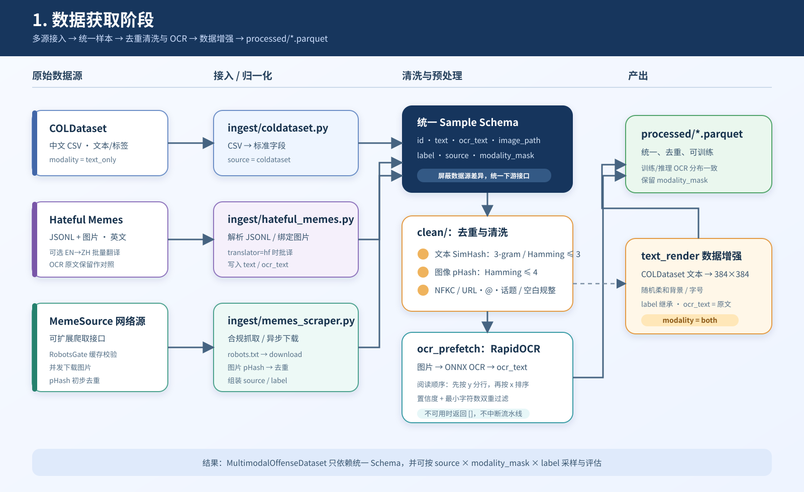
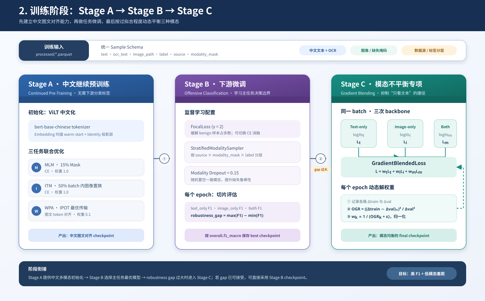
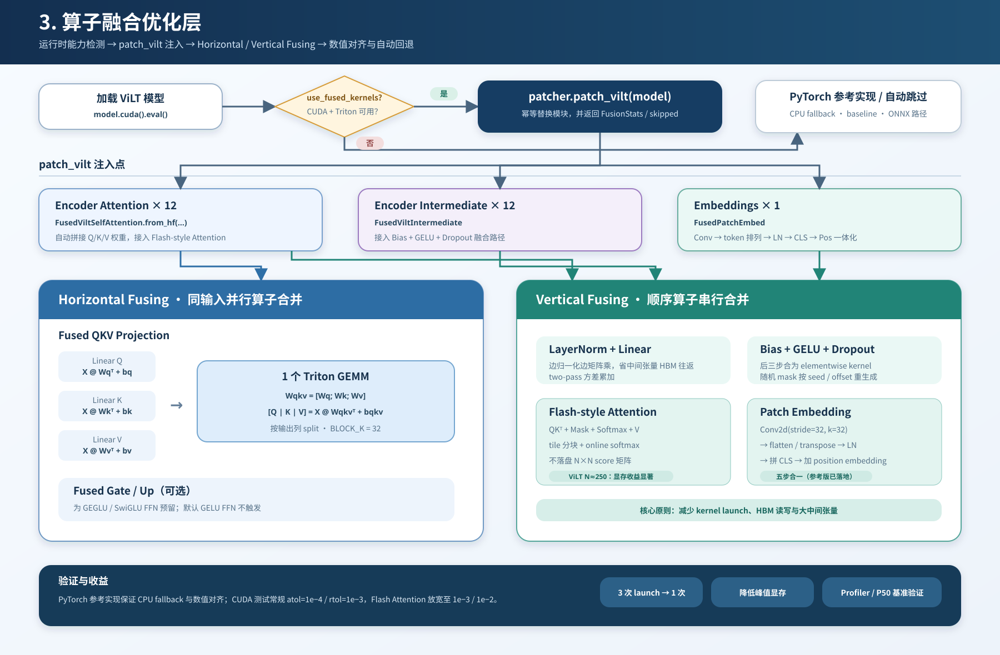

# OTS — Offensive Text Scanner (v0.2, multimodal)

End-to-end multimodal offensive content detector:

- **Model**: ViLT (English checkpoint → Chinese continued pretraining → fine-tune)
- **OCR**: RapidOCR (ONNXRuntime, lightweight)
- **Training**: 3-stage pipeline with modality-imbalance mitigation (Gradient-Blending, Modality Dropout, Focal Loss)
- **Inference**: Hand-written Triton kernels (horizontal QKV / Gate-Up fusion, vertical LN+Linear / Flash-style attention)
- **Backend**: FastAPI + Celery + Redis with dynamic batching and SSE/WebSocket streaming
- **Frontend**: Chrome extension (MV3) in React + Vite + TypeScript + Tailwind + shadcn/ui

```
OTS/
├── ots_core/          # model, data, training, fusion kernels, inference
├── backend/           # FastAPI gateway + Celery workers
├── extension/         # Chrome MV3 extension (React/TS)
├── benchmarks/        # fusion & API benchmarks
├── scripts/           # train / export / bootstrap
├── tests/
├── docs/
└── legacy/            # old Flask + BERT baseline (kept for comparison)
```

## Quick start (dev)

```bash
# Python environment
pip install -e ".[backend,triton,dev]"

# Run the full stack
docker compose up -d redis backend worker-cpu worker-gpu flower

# Build the extension
cd extension
npm install
npm run build        # → extension/dist
```

See [`docs/architecture.md`](docs/architecture.md) and [`docs/training.md`](docs/training.md) for deeper details.

## 模型层流程图

以下流程图依据 [`docs/model_layer.md`](docs/model_layer.md) 绘制，分别展示数据获取、三阶段训练和算子融合优化路径。

### 1. 数据获取阶段



### 2. 训练阶段（Stage A / Stage B / Stage C）



### 3. 算子融合优化层



## Roadmap

Milestones M1–M8 are tracked in `.cursor/plans/ots_multimodal_refactor_*.plan.md`.
